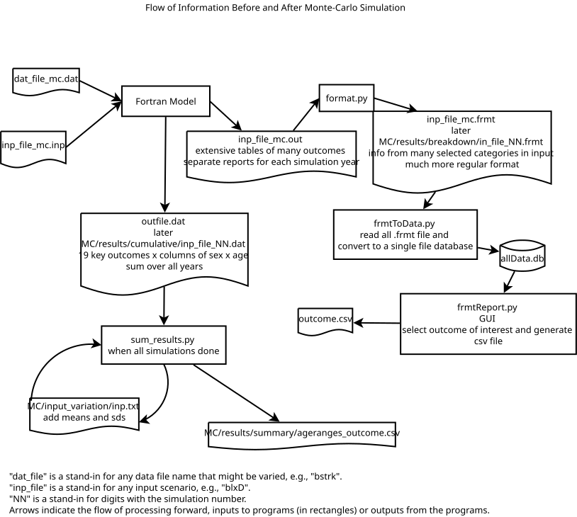
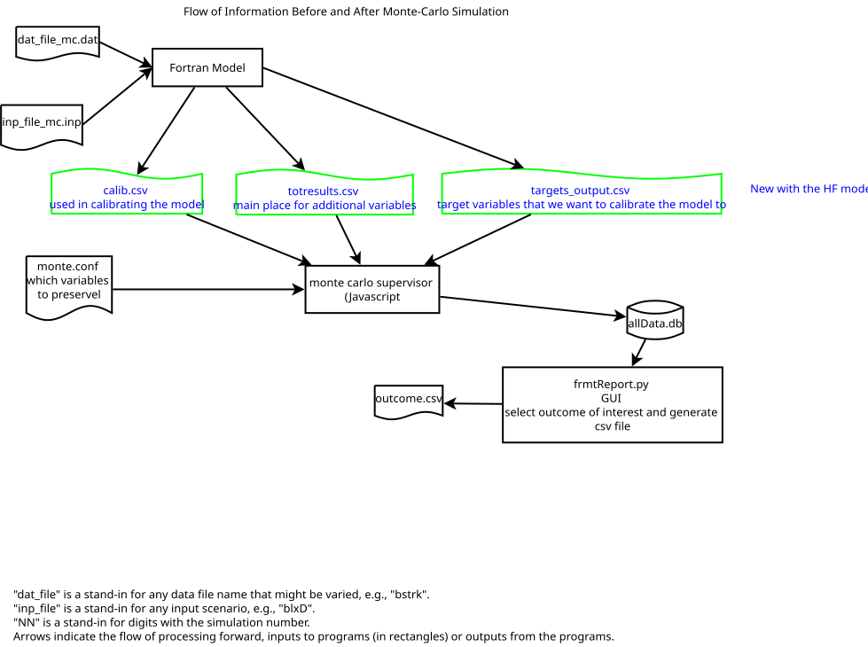

Someday, this may be a complete guide to the monte-carlo system.  For now, it's mostly a guide to the new features for the Heart Failure model.

From the standpoint of the monte carlo simulator, the important change with heart failure is not the heart failure but a new way to output data from the `Fortran` program.

# Big Picture

## Programs and Packages

This package--bundle of software--is called `mccli`.  It is made of a bunch of parts written in a mix of `Javascript` and `Python`.  It also invokes the main CVD model, a binary program created from `Fortran` source code, managed separately from this package.

`Javascript` and `Python` require interpreters to execute the source code, while the `Fortran` program requires a compiler to turn it into an executable file.  The `Javascript` is designed to be run under `Node.js`, generally invoked as `node`, while the `Python` programs are run by `python.exe` or a similar program.  The `Fortran` executable requires supporting libraries that must be installed on the system on which it is run.

All these systems require supporting material, which may be called libraries, packages, or modules.  `Node.js` and `Python` both have facilities for managing such dependencies in a way specific to a particular project (called a `Virtual Environment` in `Python`), and the instructions have you use both.

The virtual environments are associated with a particular installation of the system; ordinarily there is no reason to repeat them for each particular analysis.

The top level of the simulations is managed by `Node.js` running code from `mc.js`.  For simulations it uses `runSims.js` to do most of the work.  It repeatedly calls `montecarlo.py`, a `Python` program, to generate simulated inputs for the `Fortran` CVD model.  `runsSims.js` invokes the `Fortran` and collects and processes the results, generally using additional `Python` programs to do so.

The `Fortran` program is completely unaware it is running under a monte carlo simulation, and has a lot of fixed names for input and output files.  `mccli` fools it by doing a lot of file renaming so the CVD model always sees the same file names but `mccli` keeps them with names that have the iteration number at the end.

## Data

The code, in particular the main `Fortran` model, requires a great deal of data in many different files to run.  Loosely, this consists of model parameters and configuration information.

The model parameters govern things like the population size, the background rate of various risks, and the demographics of the population, including the rates of different risk factors.

The configuration information defines the exact years to simulate, the interventions to consider, the risk factors to use, the variables to record (in the new scheme),  and the uncertainty to consider.  The analyst is likely to need to specify these fresh for each analysis.  The `Fortran` program gathers much of this interactively, but for simulations we prepare a response file and feed it to the `Fortran` program.

# Old Processing Flow

Before Heart Failure the flow of processing was as shown in the following diagram:
.

There were two main paths.  Key variables went to `outfile.dat` and `sum_results.py` generated an overall summary at the end.  The values were broken down by age and sex, but summed over all simulation years.

The path for everything else took output from the `Fortran ` model's `inp_file_mc.out`, where `inp_file` is the name of some input scenario. `format.py` converted these to human-friendlier `.frmt` files.  Originally, any analysis of any of these variables was a one-off project, but we developed `frmtToData.py` to read the formatted files and put it in a more computer friendly database.  `frmtReport.py` provided a GUI to extract reports from that database.

The database is managed by `SQLite` libraries from the code that accesses it.  Unlike most databases, it does not need a separate database program or database management.

Except for the database, all the data files were human readable and many were specifically designed to be nicely formatted tables.  When there was a single run  that was perfect, but when there are 1,000 simulations, individually examining each one is not feasible.  And the only thing the nice formatting does is make extra work: work to format the results nicely, and then work to undo that when trying to get a summary across all simulations.

# New Processing Flow

Because Heart Failure introduced a lot of new variables, it raised the question of how to output them.  Because of the desire to be human friendly, the old output routines required custom coding for each variable.  To avoid that work, the new code simply dumped them to one of 3 `.csv` files.  The different files have different kinds of variables in them.

Currently, all of the old processing still happens.  But the next diagram focuses on just the new processing:
.

Although it is not shown explicitly in either the old or new diagrams, the monte carlo supervisor is actually generating some of the input files that the `Fortran` model reads.

`mccli` consults with `monte.conf` to see which variables to record, and then puts them directly in the database, which is in the same format as in the old processing.  It uses `CVDPM_HF_Variable_List.csv`, distributed along with the program, to get a (nearly?) complete list of variables and their descriptions.  The absence of a variable on this list is not fatal [do we want it to be?]; it just means the "description" for that variable will simply be the variable name.

There are no files with iteration numbers to store results; instead, the entries in the database include the iteration number as one of the columns for each row of data.

[How to deal with different scenarios?  One option is to create a separate database for each scenario with a name derived from the scenario.  A second approach would be to use the existing `scenario` field in the database; that is a text field.]

We may want to have a command line tool that allows pulling information out of the database without the GUI.  In particular, we might say that since `monte.conf` already restricted the list of variables, we should just generate reports for everything.

## Specifying Which Variables to Keep

There are hundreds of variables in the new `.csv` files.  You can specify a subset of interest, and all the others will be ignored, i.e., not recorded in the database.  After running the simulations, if you decide you really wanted some other variables, you will have to rerun the simulations.  So, if in doubt, keep a variable.

You must specify `monte.conf` in your project directory. [What happens if you don't?].  Here's a sample:
```
# I am a comment
[targets_output]
tpoprx,cvdpop1\d
```
That means that from the `targets_output.csv` file keep the information tpoprx and any variable cvdpop1D where D is a digit.  Since no other files are mentioned, they will be ignored.

Anything from the first `#` on the line to the end is considered a comment and ignored.

In general, the file consists of sections that begin with `[]` around a file name, with or without the `.csv`.  The program knows what directory to look in.

Within each section is a list of variables or patterns.  Each variable is separated from the others by whitespace (1 or more space, tab or newlines) or a comma with optional whitespace around it.

The rules about separators mean that all the following are equivalent:
```
a,b,c
# or
a b c
# or
a, b, c
# or
a
b
c
# or
a    ,

b,c
```

On the other hand, these are illegal:
```
# wrong separator. each line is one giant nonsense variable name.
a;b;c
a:b:c
#even worse the bad separator is part of the variable name, e.g., a; is on
#this list.
a; b; c
```

The pattern must match the complete name; specifying `tpop` in `monte.conf` will not include `tpoprx` in the results.

However, `tpop*` is a pattern that will match anything starting with `tpop`, including `tpop` and `tpoprx`.

Similarly, `*hf*` will match anything with `hf` in it, including `hf`.  And `*hf` matches anything ending in `hf`.

If you use `*` anywhere but the start and end it means something else; in particular `h*f` will *not* match `humanf`.  More about this in a moment.

If you want to do something fancier, the pattern can be almost any `Javascript` [regular expression](https://developer.mozilla.org/en-US/docs/Web/JavaScript/Reference/Regular_expressions).  Click the previous link for the full syntax. `cvdpop1\d` is an example, since `\d` means any digit in a regular expression.  It matches `cvdpop10` and `cvdpop18` but not `cvdpop1`, `cvdpop01`, `cvdpop21` or `cvdpop121`.

*The rest of  this subsection is reasonable to skip on first reading, and only matters if you try more exotic patterns.*

The patterns entered are always interpreted as regular expressions, so any character that is special in regular expressions is special here, and may need to be escaped, i.e., preceded by `\`, if used literally.  Such characters are usually punctuation, which we do not expect in variable names, so this shouldn't matter much.  If a variable name had a dot in it, escaping would be necessary, e.g., `pop\.32` to match a variable named `pop.32` without matching `popa32`. Omitting the escape makes a pattern too broad: the pattern `pop.32` does match `popa32` since `.` matches any character.

`*` is one of those special characters, and there are details about it that you may need to understand if you start using it in regular expressions.  So far `*` in a pattern means "anything".  This is one common use, e.g., when specifying file names (sometimes referred to as "shell globbing").  But in a regular expression `*` is an indication of how many times the *preceding* expression can occur (it's a quantifier). `x*` is a pattern that matches 0 or more occurrences of `x`, where `x` is a pattern--usually just the previous character (similarly, `x+` matches *one* or more `x`; `x{3,5}` matches anywhere from 3 through 5 `x`s).  So `*` doesn't mean anything on its own.  To allow leading or trailing `*` to work as described above, they are replaced internally by `.*`, which matches 0 or more abitrary characters.

You will never start a proper regular expression with `*` since it is meaningless without a preceding pattern.  But you might want to end a regular expression with `*` in the regular expression (zero or more) sense rather than the "match anything" sense.  To prevent the translation to `.*` add noise so `*` is not literally the last character.  I suggest adding a meaningless word boundary, `\b`: `tpop*\b` will match `tpop`, `tpopppp`, or even `tpo` (remember: `*` is *zero* or more in a regular expression), but it will not match `tpoprx` (which requires the "anything" interpretation of `*`).

As you may have guessed, the pattern you enter is implicitly preceded by `^` and ended by `$`, the begin and end patterns, to assure that a complete variable name is matched.  There is no point in inserting them yourself.