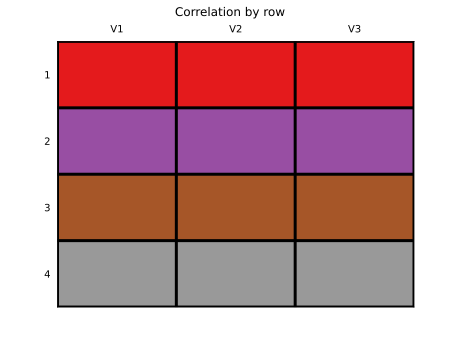
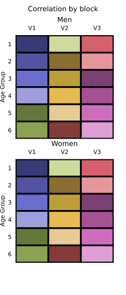
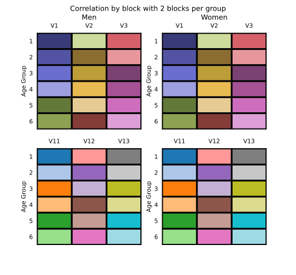

Notes for Programmers and Advanced Users

These notes initially recorded the results of an analysis of what files `montecarlo.py` uses (that [section](#notes-on-internal-use-of-files) is still here, with the addition of files used by `runSims.js` and the `Fortran` model).  But it has expanded beyond that, as seen in the table of contents just below.  And since it's not just about `Python`, it probably belongs in a different directory (the `HF` branch has already moved it under `doc`).  But for  now, it remains in `bin/python`.

This is not intended to be read end-to-end.  As you discover new things, you may want to add them to this document.

- [Developer Tools](#developer-tools)
  - [Debugging](#debugging)
  - [Testing](#testing)
    - [`pytest`](#pytest)
  - [Graphics and `Qt`](#graphics-and-qt)
  - [Code Layout](#code-layout)
- [Notes on Internal Use of Files](#notes-on-internal-use-of-files)
- [Other Notes](#other-notes)
- [Sampling for .inp and .dat Files](#sampling-for-inp-and-dat-files)
  - [Specification of Random Distributions for .dat Files](#specification-of-random-distributions-for-dat-files)
    - [filename](#filename)
    - [format](#format)
    - [correlation](#correlation)
    - [blocksPerGroup](#blockspergroup)
    - [sumToOne](#sumtoone)
    - [distribution](#distribution)
    - [rowLabels](#rowlabels)
    - [danger](#danger)
    - [Miscellaneous details](#miscellaneous-details)
- [Getting Error Info from Python](#getting-error-info-from-python)
- [Parallel](#parallel)
  - [Challenge: File Conflicts](#challenge-file-conflicts)
  - [Challenge: Interactivity](#challenge-interactivity)
  - [Challenge: Subprocess Management](#challenge-subprocess-management)
    - [Capturing output as it occurs](#capturing-output-as-it-occurs)
    - [Sub-subprocess output](#sub-subprocess-output)
    - [`JSON` format](#json-format)
  - [Challenge: `asyncio`](#challenge-asyncio)
    - [`Qt`](#qt)
    - [`SQLite`](#sqlite)
  - [Challenge: Symbolic Links on `MS-Windows`](#challenge-symbolic-links-on-ms-windows)
    - [Junction Points](#junction-points)
    - [Plain Old Directories](#plain-old-directories)
    - [Unix on Windows](#unix-on-windows)
  - [Persistence](#persistence)
  - [Matrices of Time](#matrices-of-time)
- [Log](#log)
  - [2022-09-14](#2022-09-14)
- [To Do](#to-do)

# Developer Tools
As will be clear from the installation instructions, this system combines a lot of different systems.  These notes are particularly for those who want to develop with the system.

The operation employs a software stack, with `Node.js` running `mc.js` at the top level.  As it runs, it executes various `Python` programs and the core model, typically `CVDMODYY`, which is in `Fortran`.  This project does not include the `Fortran` code, and can work with various versions of it.  Note, however, that recent versions of this code, typically identified as "heart failure" or "HF" require newer versions of the `Fortran` model.

Even if you are not building the `Fortran` model from source you will likely need to install some supporting libraries from the `Fortran` compiler vendor for the binaries to run.  Our practice has been to package the `Fortran` binary (for `MS-Windows`) with the project data; the montecarlo code expects it to be there.  Sometimes an installer for the `Fortran` libraries is with the program.

To keep things interesting, one can go one level more meta and use this package's `maestro.py` to automate parallel runs.  This puts a `Python` program on top of the whole previous stack.

It is useful to have tools that can handle several languages at once.  We have found `Visual Studio Code` useful; it runs on most major platforms.  Some of the code in the possibly never-to-be-completed `HF`  (Heart Failure) branch uses a literate programming extension that is specific to `VSCode`.  If you switch to the `HF` branch there is much more documentation about that.

Note there is also a simpler `base-HF` branch that handles a change in the format of outputs for Heart Failure.  It and its descendants, `parallel` and `justice` all work with the new Heart Failure `Fortran` models.  They are all "completed".

## Debugging
Since processes in one language launch processes in another, debugging can be awkward; if you are debugging the top-level program you can't just step into the lower level program it invokes.  In a typical scenario something goes wrong in a monte carlo run, but the failure is in `Python` program it invoked.  Further, a lot of the error information tends to get lost as it traverses levels.  This is particularly so because the invocation from `Node` typically hides the output of the subprocesses it invokes.  I, Ross, have used several approaches to this.

1. Run the invoked program separately under a debugger.  This requires guessing how it was invoked and assuring that all the necessary inputs are in place.
2. Track exactly how it is invoked by printing out the arguments or stepping through the top-level process in the debugger.  This will also assure that any necessary setup, e.g., creation of files, takes place.  Then one can use this information to do step 1.  It generally requires the ability to pass command-line arguments for the underlying program into the debugger.
3. Make the invocation of subprocesses more verbose.  For example, in `runSims.js` change `shell.exec(someCommand,{silent:true});` to `shell.exec(someCommand,{silent:false});`.  This may overcome the fact that `print()` commands in `Python` otherwise may leave no trace.
4. Make the lower-level program wait, perhaps by waiting for terminal input or going in a loop or execute a debugging breakpoint.  Then start an appropriate debugger and attach to the process.  I used this in `Visual Studio` and `Visual Studio Code`.
5. `Visual Studio Code` has a well developed [procedure](https://code.visualstudio.com/docs/python/debugging#_command-line-debugging) for attaching to new `Python` processes.  If you want to debug `montecarlo.py` you can invoke `node mc run` with `--vscdebug` to trigger it.  You will still need to set up a `launch.json` configuration in `VSCode` to attach to it (or maybe not--see the sample under `.vscode` in the repository and its `Attach to montecarlo.py` configuration).  I found that, despite the `--wait-on-client` option the subprocess didn't halt unless I set a breakpoint in it.

If you want to use the last option you **must** install `debugpy` in the appropriate `Python` environment.  And, obviously, you need to be using `VSCode` with the relevant `Python` extension.

## Testing

Test coverage is currently minimal: there are no `javascript`/`Node` tests and only a few  for `Python`.  For the latter we use the [pytest](https://docs.pytest.org) framework, and the tests and test data are under `py_tests`.

Testing requires the `Python` package `pytest` and benefits from `pytest-cov`, which provides coverage analysis of the tests.  Both are in `requirements.txt` but commented out.  You need to either uncomment them early in the `mccli` installation process or use `python -m pip install pytest pytest-cov` to install them later, in the appropriate virtual environment.

None of the tests run automatically; you will need to trigger them manually.

If you are using `Python` virtual environments, as recommended, you should run the tests from within that environment.  Some of the tests may assume that you are using a virtual environment and that it is in the `pyenv` subdirectory of the project.  It is also possible that the tests must be run from the top level of the project.

`VSCode` offers many [conveniences](https://code.visualstudio.com/docs/python/testing) for running some or all tests, inspecting the results, and debugging problems.  See the flask icon on the activity bar, usually on the left.

### `pytest`

This subsection has some notes on `pytest`, a `Python` testing framework, for those writing new tests.

To access `pytest` **features** put an argument of the same name in the definition of the test function.  You can use as many as you want: `def test_shared_prefix(pytestconfig, monkeypatch, request):`.  You can then pull information out of the arguments, or directly use the arguments.

There are potentially a lot of directories involved in running a test:

  * The directory from which `pytest` was launched
  * The root directory of `mccli`
  * The test directory `mccli/py_tests`
  * The directory with data for the test
  * The directory for the `Python` virtual environment
  * The directory in which the `Python` executable resides
  * A temporary directory in which to run the test

**Getting the directories reliably**, with a minimum set of assumptions, is challenging.  That is one reason for the advice to always run `pytest` from the `mccli` root.

`request.path` gives a `pathlib.Path` object that is the full path of the file running the test, e.g., `C:\Users\rdboylan\Documents\KBD\mccli-justice\py_tests\test_sum_results.py` for tests run from that file.  I believe that will be more stable than just using `__file__`, which won't be right if the test uses other modules for getting directories.

From that location one can navigate to any other part of the tree.

There are some other constructs that are not reliable. `request.config.rootpath` or the equivalent (I think) `pytestconfig.rootpath` use an algorithm that will not reliably find the root, even if run within the `mccli` directory tree, much less if the working directory is outside of that tree.  The algorithm looks for files that are not present, because the `mccli` neither is nor contains a regular `Python` package.

Locating the `Python` **virtual environment** is challenging for several reasons:

  1. There may be no virtual environment.
  2. The virtual environment may not be in the expected location `mccli/pyenv`; it may not be under the `mccli` at all.
  3. Even given the top of the virtual environment, the complete path to its `Python` is variable.  Under `MS-Windows` one should look under `Scripts`; most other systems use `bin`.  Further, the exact name of the executable varies: it has an `.exe` extension on `MS-Windows` but not elsewhere, and it may go by `python` or `python3`.

The safest way to activate the virtual environment if the test runs a program in a subshell is to use `sys.executable`, which gets the complete path, including the file name and extension,  for the `Python` that is executing the test.  This *only works if `pyenv` was launched using the desired virtual environment*.  The virtual environment is set up so that if you invoke its version of `Python` you will get the whole environment.

In `VSCode`, `Path.cwd()` always returned the root `mccli` directory when run by a test function, even though those functions are in files further down the directory tree.  As noted, that doesn't seem like something to rely on in general.

`sys.executable` gives the full path of the running `Python`,  even if there is no active virtual environment.  Use `sys.prefix != sys.base_prefix` to tell if a virtual environment is active or not.

The best way to **change the working directory** temporarily is with `monkeypath.chdir("somewhere")`.  This will revert back to the original directory at the end of the test function, without any need to program that explicitly.  Or, if using `subprocess.run()` one can use the `cwd=` argument to set the working directory for the spawned subprocess.

One can create **new fixtures** with
```python
import pytest

@pytest.fixture
def my_new_fixture():
  # stuff
  # return the value of the fixture
```

The function definition may have fixtures as arguments.

## Graphics and `Qt`
This package currently uses the `Qt` toolkit to create a graphics application.  The only such application is `frmtReport.py`, a somewhat specialized application for post-processing the results of a simulation.  The `Python` package `pySide2` provides the interfaces (to `Qt5`, despite the name). As the [README](../../README.md) indicates, this is a problem because it is a relatively large package, because it depends on parts (namely the `Qt` libraries) that may not be virtual environment respecting, and most of all because it is obsolete.  The last binary package for `pySide2` on `MS-Windows` is for `Python 3.10`.  That version is officially supported until [2026-10](https://devguide.python.org/versions/)--sort of: "After two years (18 months for versions before 3.13), only security fixes are accepted and no more binaries are released." I don't see how a source-only release of a security fix is at all helpful to users who need binariess.  So using an older `Python` carries security risks, at least on `MS-Windows`.

In general, as time passes, current versions of other packages will not be available for `Python 3.10` and so using the older version will tend to freeze your entire `Python` ecosystem.

`pySide2`'s successor, `pySide6`, wraps `Qt6`.  It includes some features, especially `asyncio` integration, that are potentially quite important.  `Python`'s async framework uses an event loop; `Qt`'s GUI uses an event loop; if you want to use them both you need an integrated event loop, which the newer `Qt` provides.  The code `maestro.py` uses relies on the async framework.  I have also contemplated using `Qt` for other non-graphical services like using `SQLite`, which again raises integration issues.

I do not know if one program can use both versions of `pySide` at once.  Even if it's sometimes possible, I assume there can only be one event loop.

The move to `pySide6` is likely relatively easy and the interface pretty similar.  But someone would have to replace the `import`'s from `pySide2` with `pySide6`, create an appropriate virtual environment, update the `requirements.txt` file and other documentation discussing the issue, verify that everything still worked, and then deal with anything that didn't.  The most likely change would be some rearrangement of the namespace.

## Code Layout
Most of the code is under `bin`, in the `python` subdirectory for `Python` and the `js` directory for `Javascript`, to be executed by `Node.js`.  There are a few higher level programs at higher levels.  The top-level code for automatic parallel runs is `bin/python/maestro.py`, using the library in `bin/python/symphony`.

Some `Python` specific documentation appears under `bin/python`, including the `maestro` documentation and this file, which really isn't just about `Python` any more.  In some branches I believe I already moved it elsewhere.

`node_modules`: Effectively the `Node` virtual environment for this project.

`pre-build`: For documents to create before the ordinary build step.  `CorrGraph.py` creates some images and requires `numpy` and `matplotlib` to function.

`py_tests`: For `Python` unit tests using `pytest`, a testing framework supported by `VSCode`.  Many of the tests do not execute by default since they rely on file scattered around my disk.

`pyenv`: `Python` virtual environment (from `venv`) for this project.
# Notes on Internal Use of Files
`montecarlo.py` reads an input file (or is it a dat file?) from `_mc0.<ext>` and writes to `_mc.<ext>`.  The javascript code copies the _mc to a numbered version, but that is strictly for archival purposes; the Fortran model will use the _mc file.

The input files `${inp_files[j]}_mc.inp` are not renamed; they are specified as inputs to the fortran model on the command line via shell redirect.
These input files are manually modified at the start to select xx_mc.dat files for the appropriate parameters.  The input file just has a number selecting an entry in a .lst file.  The .lst file is also modified manually.  See the instructions above in the "Modfile setup" subsection for this.

It looks as if the varied files are written to the same spot as the inputs, i.e., _mc are written next to the _mc0 files.  *So the python code also has the embedded assumption that just one simulation is happening at once.*

`Modary.f90` line 157 begins definition of files for b (`filename(7)`) and `copy input\b'//rfn//rfk//'.dat modfile\b.def`. I guess `rfn` and `rfk` (defined in `main.f90` @151; `rfn` is set either to `6` in `Modarray.f90` or, I think, in a weird write statement in `addrfs.f90`@159 `WRITE(rfn,'(i1)') irft`) indicate what type of riskfactors were chosen.  Example source files are `B6SBD.DAT` and `B8SPKpool.DAT`.

`Modary.f90` @441 resets `filename(7)` with the selected entry in the list, if you have said you want to modify it.

`Subs.f90`@1070 `picfile()` allows user to select from list retrieved from an inputlst file in `modfile\`.  That's `b.lst` in this case. *If* the file has more than one alternative, ask user which to pick.  The name of the selected file is set in the `filname` argument, known as `tmpfile` in the caller.  Then copy `modfile\<selected name>` to a temp file `utils\zzzCHDedit.tmp`. *This is another move that will fail with parallel runs.*  Resets the name in `filename(7)`. User gets chance to edit it and I think it ends up with the regular name.  `Modary.f90`@460 calls `initial` with `b` the first argument.

`init.f90` defines that subroutine at the top.  It reads in the b coefficients from `modfile\` starting at line 426.  Writes the input matrix as text to `input\inputchk\b.def` as a way to allow a check by a person that the input was read OK.

The `b` array is defined in `module modelarrays`.  Although `initial()` does not use the module, using function arguments instead.  Fortran is generally call by reference.

Here's a list of the inputs and outputs mentioned explicitly in `runSims.js`.  It does *not* include all files the python programs or the Fortran model read and write.

| Read                                        | Write                          |
|---------------------------------------------|--------------------------------|
| MC/inputs/input_data.json||
| MC/results/cumulative (test for prior run) | MC/saved_runs/XXX (copy results and input_variation)|
|                          | MC/results  (emptyDir)|
|                          | MC/results/{breakdown,cumulative,summary}|
|                          | MC/input_variation (last emptyDir)|
| /usr/bin/python          ||
| MC/input_variation/inp.txt (optional)|MC/input_variation/inp.txt (iteration number)|
|operation of python program | happens here for dat files|
| modfile/dat_file_mc.dat   | MC/input_variation/dat_files/dat_file_NN.dat (copy)|
| (only if previous name > 12 chars)| modfile/truncated name (link)|
| inp_file_mc{,0}.inp       | inp_file_mc.out (delete)|
| CVDIntel9.2exe (with inp_file_mc.inp)| MOD_zerorun.txt (iteration 0 only)|
| format.py  inp_file_mc.out  | inp_file_mc.frmt|
| inp_file_mc.frmt          | MC/results/breakdown/inp_file_NN.frmt|
| outfile.dat               | MC/results/cumulative/inp_file_NN.dat|
| sum_results.py (when all done)||
|                           |MC/results/.run|


# Other Notes

Command line from runSims.js usually has `-s` (save outputs), `-i` and `--seed` but no file names or directories.  Looking through the code, it seems `-s` only matters for outputs of the zero run.

I don't know where, but something seems to clear out `inp.txt` at the start of a run.  I ran after having done a preliminary run that produced `inp.txt` with headers and an initial line.  After the run started there was no sign of duplication.

`MC/inputs/input_data.json` read to find what to vary.  Use lists in 2 sections, 'dat_files' and 'inp_files'.  For 'dat_files' the zero run (`-z`) does nothing except write the data out.  For 'inp_files' the zero run writes out labels.  Both execute `vary()` on the file object and then `print_mc()`.

`VFile(fname)`
    `pref,ext = fname.split('.')`
    input: pref+'_mc0.'+ext
    output: pref+'_mc.'+ext

It reads from an `_mc0.EXT` file and writes to `_mc.EXT`.

`DatFile` includes an `SDFile` but `InpFile` includes `Effects`.
    `DatFile(file_data, random_generator)` where `file_data` is a `JSON` structure
    that include 'filename' -> `modfile/FILENAME.dat` as primary input (for `VFILE`).

`InpFile(fname)` calls `VCFile(fname+'.inp')` and then creates
    `Effects` which has no arguments.

`Effects` reads from `MC/inputs/inp_distribution.txt`.
    Writes to `MC\input_variation\inp.txt`.
    Uses `Component` in a transitory way to wrap some lines.
    This javascript code in `runSims.js` actually fills in the iteration number which is the first field on the data lines:

   ```javascript
        let str = String(i + ' '.repeat(16));
        let INP_OUTPUT_FILE = './MC/input_variation/inp.txt';
        if (fs.existsSync(INP_OUTPUT_FILE)) {
            fs.appendFileSync(INP_OUTPUT_FILE, str.substring(0,16) + '  ')
   ```

`Component` actually generates the random number and interprets 
    parameters.  It would probably be better to generate them once and retain them.
    Although `Component` instances are temporary, there is persistent state held in a class variables.  This is the state of the random number generator for each group.

Note that `montecarlo.py` is only used to generate a single simulation.  Because of the state-keeping in `Component` it would actually generate the same numbers if called again.

An effect may be made of several components that are summed or added to the mean.

2022-09-13 Start `issue12` branch to fix random number generation with LogNormal .inp files.
Initial focus on being able to run tests.  Create `py_tests` folder at very top level to use the pytest framework, and configure `VSCode` for same. Created `test_monte.py` and, after painful experiments with getting it to load the code, made a simple test work.

Further testing of `Effects` revealed 2 different ways the code was inconsistent with the current `numpy.random` interface:
  1. The state has moved to the `BitGenerator` and is not directly accessible.
  2. `randn` is obsolescent (it is still available, but not through the old interface).
Fixed both.

Sampling for .inp and .dat Files
================================

The code handling random number generation for .inp files, in `InpFile`, `Effects` and `Component` is almost completely separate from that for .dat files in `DatFile` and `SDFile`.  This results in numerous differences, some intentional and some not (e.g., interpretation of parameters for the same distribution differs between .inp and .dat.)

Our current code for the .dat file simulations does not handle Gamma (or possibly treats it as Normal).

Since it would be good to put the code for each distribution in one place, it would be good to resolve this inconsistency, even though there are currently no gamma parameters in the .dat files.

Other notable differences between .dat distributions and .inp distributions
1.	The user never specifies the type of distribution for .dat files; it is wired in to the definition of the variables in the code.  For .inp files the user does set the distribution (often by omission, which means normal).
2.	The .dat distribution is set per parameter in bin\input_data.json and none are gamma.
3.	Likewise, the .dat correlation structure is defined with the variable and may be block or row.  User doesn’t set it.  
4.	The .inp correlation structure differs from that for .dat, and is user-defined by groups.
5.	.dat defines the mean and sd in 2 separate files. .inp defines the distribution parameters in one file.
6.	For .inp, but not .dat, one can specify max or min values for the generated samples.
7.	.inp allows “MEAN” to be given as the mean, in which case the second parameter is taken to be a coefficient of variation around the original mean (I think?).  I don’t think that’s an option for .dat.
8.	The .dat file has a bunch of special rules to handle “illegal” values of the beta parameters.  Negative means flip the sign  of the result from the corresponding positive mean, and sd <= 0 result in always drawing the mean value.  .inp files get no such rules.
9.	.inp files allow you to specify multiple components, all of which are summed to give the parameter of interest. .dat files don’t.
10.	.inp files attempt to achieve random number correlation by matching seeds; .dat files do so by matching quantiles.

Specification of Random Distributions for .dat Files
----------------------------------------------------

The method for varying particular `.dat` files is specified in `input_data.json`.  Here's a sample:
```json
{
	"all_dat_files" : [
		{
			"filename": "b",
			"format": {
				"leading_spaces": 14,
				"mid_spaces": 3,
				"num_format": "9.6f"
			},
			"correlation": "block",
			"blocksPerGroup": 2
		},
```

As far as I can tell, the meanings of these options aren't specified anywhere.  This subsection attempts to remedy that; it is based on inspection the `Python` code, mostly in the `SDFile` class of `montecarlo.py`.

The rest of this subsection is organized by the different keys that are available for the `all_dat_files` entries.  The keys are all strings, enclosed in double quotes as in the preceding sample.  Each entry provides the allowed values and their meaning.

As already indicated, the methods for specifying variation in `.inp` files are significantly different; do not assume that the information here carries over to them.

### filename
is a string, the root of the file names used for input and output.  If the name is `X` then inputs are read from `X_mc0.dat` and `X_sd.dat` and the random output is in `X_mc.dat`.

`X` may differ from the standard name for the file being varied; in particular it may be shortened so the `Fortran` program can accommodate it.  The remapping of names is accomplished through the `.lst` file for the original file name.

For example, one of the `.dat` files is `shortwgt`.  If that were used directly, one input file would be `shortwgt_mc.dat` which, at 15 characters, is over the 12 characters allowed by our `Fortran` code.  Since `_mc.dat` is 7(*) characters, that leave 5 characters maximum for the base name. So we shorten the base name to `shrt`.  Here is what is in `SHORTWGT.LST`:
```
  4
 shortwgt.def
 shrt_mc0.dat
 shrt_mc.dat
 shrt_sd.dat
```
There is no `SHRT.LST` file, because the `Fortran` model is expecting `shortwgt`.

(*) `_mc0.dat` is 8 characters, but I don't think the `Fortran` program ever reads that in.  If you want to be sure, limit the base name to 4 characters.

`input_data.json`, on the other hand, has an entry with `"filename": "shrt"` and nothing for `shrtwgt`.

The `.lst` files must be set up manually, as well as telling the `Fortran` program which list item to use (typically in an `.inp` file).

### format
The `format` section controls how values are written, but not read.
There are 3 keys, `leading_spaces`, `mid_spaces` and `num_format`.  The first two are integers and the last a string containing a `Python` format specification for an individual numerical value.  Each value will be output with `num_format` followed by `mid_spaces` spaces.  Each output line will have `leading_spaces` spaces at the start.

Conversion from the input line, a string, to numbers is via `Python`'s `float()` function applied to each result of `split()`.  Unless `rowLabels` is `False` (see below), the first element of the split is skipped.

### correlation
If present, acceptable values are `"block"` or `"row"`.

Individual numbers are either uncorrelated or "perfectly" correlated.  Let X and Y refer to 2 such numbers; in general they are drawn from different distributions with different means and standard deviations.  They match in the sense that if the value for X is at the p'th percentile of the distribution for X, they value for Y is at the p'th percentile for Y's distribution.  This will not necessary have a conventional (Pearson) correlation of 1.0, although that is true for the Normal distribution.

In correlation by `row`, numbers in the same row are correlated with each other.  The figure immediately below illustrates this; cells that are the same color represent numbers that are correlated.


Correlation by `block` induces correlation between rows within the same column.  See the next [subsection](#blockspergroup) for the details.  It is *not* the case that all values in the same column will be correlated.

A block is a group of 6 consecutive data rows.  This is because our model typically has 6 age categories, and the corresponding values are on different rows of our input files.  In the simple case, correlations look like this: 

.

In all other cases values are uncorrelated.


### blocksPerGroup

An optional integer, specifying how many vertical blocks the variables for a single group occupies.  Defaults to 1.  It's easier to explain with an example.

Sometimes data look like this, for `shrtwgt`:

| MALES | | | | | | | | | | |
|---------|---------|---------|--------|--------|---------|---------|--------|--------|--------|--------|
| AGE     | 1-noEVT | 2-Rev   | 3-MI   | 4-Arr  | 5-RevMI | 6-RMIHF | 7-HF   | 8-MIHF | 9-IS   | 10-HS  |
| 35-44   | 0.0000  | -.0029  | 0.0079 | 0.0079 | 0.0192  | 0.0192  | 0.0000 | 0.0079 | 0.0113 | 0.0113 |
| 45-54   | 0.0000  | -.0029  | 0.0079 | 0.0079 | 0.0192  | 0.0192  | 0.0000 | 0.0079 | 0.0113 | 0.0113 |
| 55-64   | 0.0000  | -.0029  | 0.0079 | 0.0079 | 0.0192  | 0.0192  | 0.0000 | 0.0079 | 0.0113 | 0.0113 |
| 65-74   | 0.0000  | -.0029  | 0.0079 | 0.0079 | 0.0192  | 0.0192  | 0.0000 | 0.0079 | 0.0113 | 0.0113 |
| 75-84   | 0.0000  | -.0029  | 0.0079 | 0.0079 | 0.0192  | 0.0192  | 0.0000 | 0.0079 | 0.0113 | 0.0113 |
| 85-94   | 0.0000  | -.0029  | 0.0079 | 0.0079 | 0.0192  | 0.0192  | 0.0000 | 0.0079 | 0.0113 | 0.0113 |

| AGE     | 11-ISrv | 12-HSrv | 13-ISHF | 14-HSHF | 15-ISrHF | 16-HSrHF | 17-RevHF | 18-ArrHF | 19-Ang | 20-AngHF |
|---------|---------|---------|---------|---------|----------|----------|----------|----------|--------|----------|
| 35-44   | 0.0113  | 0.0113  | 0.0113  | 0.0113  | 0.0113   | 0.0113   | -.0029   | 0.0079   | 0.0078 | 0.0078   |
| 45-54   | 0.0113  | 0.0113  | 0.0113  | 0.0113  | 0.0113   | 0.0113   | -.0029   | 0.0079   | 0.0078 | 0.0078   |
| 55-64   | 0.0113  | 0.0113  | 0.0113  | 0.0113  | 0.0113   | 0.0113   | -.0029   | 0.0079   | 0.0078 | 0.0078   |
| 65-74   | 0.0113  | 0.0113  | 0.0113  | 0.0113  | 0.0113   | 0.0113   | -.0029   | 0.0079   | 0.0078 | 0.0078   |
| 75-84   | 0.0113  | 0.0113  | 0.0113  | 0.0113  | 0.0113   | 0.0113   | -.0029   | 0.0079   | 0.0078 | 0.0078   |
| 85-94   | 0.0113  | 0.0113  | 0.0113  | 0.0113  | 0.0113   | 0.0113   | -.0029   | 0.0079   | 0.0078 | 0.0078   |

|FEMALES| | | | | | | | | | |
|---------|---------|---------|--------|--------|---------|---------|--------|--------|--------|--------|
| AGE     | 1-noEVT | 2-Rev   | 3-MI   | 4-Arr  | 5-RevMI | 6-RMIHF | 7-HF   | 8-MIHF | 9-IS   | 10-HS  |
| 35-44   | 0.0000  | -.0029  | 0.0079 | 0.0079 | 0.0192  | 0.0192  | 0.0000 | 0.0079 | 0.0113 | 0.0113 |
| 45-54   | 0.0000  | -.0029  | 0.0079 | 0.0079 | 0.0192  | 0.0192  | 0.0000 | 0.0079 |

and so on.  Each group (sex) has 20 variables; the first 10 are displayed in the first block, and the second 10 in the second block.  So this gets `"blocksPerGroup": 2`.  Here's what the correlations look like:


Although the blocks are shown in 2 columns (men and women), the actual file would have them consecutively: first the 2 blocks for men, and then the 2 blocks for women. Also, some of the colors are very similar, either across blocks (e.g., V3 for age group 2 in the first block and V12 for age group 1 in the second block) or within (e.g., in the second block age 2 V13 and age 3 V12).  They actually are subtly different. The point is that variables match across groups for a given age; all else is uncorrelated.

The result induces a correlation between values for, e.g., variable 1 in both groups, but not between variable 1 and variable 11 in the first group, even though both are in the first column.

The default processing is effectively `"blocksPerGroup": 1`, which would induce correlations between variables 1 and 11 for both men and women; all 4 variables would move in lockstep.

### sumToOne
If this parameter is present and `True` in the `Python` sense then the values on each row will be rescaled so they sum to one.  Typical use would be for proportions.

### distribution
A string: `"beta"`, `"lognormal"` or `"normal"`.  Anything else is an error, although one can omit this key and `"normal"` will be assumed.

### rowLabels

Ordinarily, the program assumes that the first column of the tables contains row headings.  If this value is `false`, without quotes, then the first column is considered data.

### danger
If present and `true` indicates to use caution when varying this file.  Currently, it is set for 2 new variables (`pcvd` and `modpr`) that ordinarily require manual calibration of the model.

`danger` is new in v3.6.0.

### Miscellaneous details
Data rows are identified as lines whose first non-blank character is a digit.  This allows automatic skipping of the descriptive information usually appearing above tables.

The input fields are separated by whitespace.

The first column is generally assumed to serve as a row label and ignored; however, the label must start with a digit for the line to be identified as data.

Getting Error Info from Python
==============================
When `montecarlo.py`, invoked from `runSims.js`, fails, very little information gets back, just a message "montecarlo.py run failed".  This is unhelpful.  Neither the exact call used to invoke the python program nor the traceback for the error or console output (if any) is available.

Some of this stems from the use of `{silent:true}` option, which is the default, for the invocation of `shelljs` (which is the module name, even though aliased to `shell`).  Apparently the return value for a syncronous call is a `ShellString`.  See https://github.com/RossBoylan/mccli/issues/20#issue-1443014991 for more.

The `python-shell` module advertises much better error reporting, but I've never been able to get it to do anything.  My latest attempts apparently couldn't even get it to run anything.  I have *2* different branches experimenting with the package, *both* named `python-shell`.  The primary archive in `J:\source\repos\mccli` has that branch with work from Feb 2022.  The archive in `C:\Users\rdboylan\Documents\KBD\mccli-release`, intended for production runs, has some *different* work from Nov 2022.  It is not based on the earlier branch.

Parallel
========

Challenge: File Conflicts
-------------------------

To run more than one simulation at a time requires assuring the different simulations do not step on each other.  The obvious way this could be a problem is if they both write to the same file.

I ran the simulation under `procmon` to capture what files were being opened, read, and written.  This showed files in almost every directory--include ones with "input" in the name (!)--got writes, many of them to files that did not have an iteration number suffix.  Also, some of the `_mc0` file may be written repeatedly.

The one bit of good news is that I did not find any mystery files that were written only for the duration of the run, being neither an input nor an output.  I thought I saw such things in an earlier version of the source code.  Or perhaps there were such files, but the names did not stand out to me.

The conclusion is that, for safety, one must copy basically the entire directory.

Challenge: Interactivity
------------------------
The monte-carlo system assumes it is running in a regular terminal with a person who can respond to prompts.  This makes it awkward to run multiple copies.

This is most obvious for `mc init`, whose primary job is to collect user input.  It does this with a curses-like interface that uses multiple rows of the terminal and allows one to scroll through alternatives.  The "solution" is to run this *before* the parallel run.

However, `mc run`, the main simulation driver, also assumes and requires such an environment.  If it encounters signs of a previous run, it asks the user what to do.  And its logging procedure has commands like `clearLine()` and `cursorTo()` that only work with a terminal.  When I ran the program with a pipe for `stdout` that same call produced an error, because the output object did not understand the command.  In `node` the stream does have an `isTTY` attribute which could be checked.  Solutions are

  1. Provide an `--overwrite` option that will suppress the query if there seems to be a previous run, acting as if the user selected overwrite the existing results.  This is risky.
  2. Provide a `--json` option which simultaneously produces `json` output and avoids any terminal manipulation commands.

Challenge: Subprocess Management
--------------------------------
To run in parallel, each simulation must run in its own process and its own directory.  Using threads is possible in principle, but `python` threads are ineffective because of the global lock.  And threads are messy anyway. While I could create separate python processes, that adds an unnecessary extra layer to the invocation of `node`.  The most effective way to deal with multiple long-lived processes is to use the `asyncio` module and coroutines to launch the different runs.

### Capturing output as it occurs

A perennial weak spot in `python` is getting output from a subprocess while it runs, rather than having to wait until it completes.  That output has progress reports, and so is essential for monitoring progress.  The advice in the documenation is to use `communicate()` to avoid deadlocks, but, as the documentation says, this only returns after the process exits.

I fond various questions about this problem but not a lot of solutions.  One suggestion was to use `readLine()` on the file handle (pipe), which worked for me once I ensured `\n` was written at the end of output lines, and once I added a rather cumbersome `asycio.Task`-based approach so I could wait on `stdout` and `stderr` separately.

In practice, it seems both tasks complete at once, even though the `stderr` reader returns a 0-byte result.

There are alternative methods of communication: shared memory, named pipes, other IPC frameworks (I considered `RabbitMQ`), even reading from a file as it is written.  But pipes seemed lightest weight and most straightforward.

### Sub-subprocess output

`runSims()` is the `mccli` `javascript` function that runs the simulations.  It invokes other processes, `python` and `Fortran` programs.  So even if the main `node` code sends everything as a `JSON` message, there may still be traffic directly to `stdin` and `stdout` that it does not control.  The `javascript` function `runSims()` attempts to capture subprocess output and convert it to `JSON`.  `maestro.py` captures both `stdout` and stderr`, separately, and attempts to recognize non-`JSON` output and convert it to `JSON`.

### `JSON` format

Every `JSON` message should have `type` field at the top level.  Here are the current values:

  * `PROGRESS` reports on progress for individual iterations.  One is issued at the start of an iteration, and another, with more information, is sent at iteration end.
  * `SUMMARY` after all iterations complete
  * `DETAIL` details of all simulations
  * `DONE` very last message
  * `ERR` error.
  * `INFO` various informational messages
  * `ARGS` arguments passed to `runSims()`
  * `DETAIL` details about the entire run, emitted once at the start and once at the end.  Also written to `MC\results\.run`.
  * `SUMMARY` start and end of the `sum_results.py` run after all iterations complete.
 
 All have a `text` field with the main message and some have additional fields.  See code for details. 


Challenge: `asyncio`
--------------------

`asyncio` is a solution that introduces its own problems.

### `Qt`

`Qt` has an event loop.  But `asyncio` has its own event loop.  They can only get along with some help.  `Qt` has a `QtAsync` module that allows the `Qt` event loop to also serve as the event loop for the `python` `async` calls.

The architecture of coroutines in `python` is a little odd.  The language definition defines some keywords, `async` and `await`, and the semantics they should have.  But it does *not* provide the mechanism so they can actually run!

The `asyncio` standard module does provide such a mechanism, but it is not the only way to achieve the task scheduling required for cooperative multitasking.  So other packages can and do provide such services.  `Qt` does so on top of `asyncio` so that code will actually use both `QtAsync` and `asyncio` modules.

*However* `QtAsync` is only available for `Qt6`, and only barely:
"[This module is currently in technical preview](https://doc.qt.io/qtforpython-6/PySide6/QtAsyncio/index.html)" as of 2025-06-15.  It seems to be available only with recent version, perhaps `Qt6.8+`.  And that in  turn limits the supported `python` versions.  Apparently 6.8 requires `python3.9` and 6.9 requires `python3.10` according to the underexplained [python compatibility matrix](https://wiki.qt.io/Qt_for_Python).

`python` support for `Qt6` is from the `pyside6` module, *not* the `pyside2` this package currently uses in `frmtReport.py`.  So using both requires 2 heavyweight installations.

`frmtReport.py` could be ported to `pyside6`, but that would take some time.

Another consideration is that `pyside6` is not obviously available as a package on stable Debian or Ubuntu (June 2025).

### `SQLite`

Since this is the database used by `frmtReport.py` and the new heart-failure code, it seems natural to use it here.  But it's synchronous, and doesn't naturally get along (may even refuse to run) with `async` settings.

There are once again some packages designed to smooth the differences.  In fact, `pyside6` has a local storage option built on `SQLite`, as well as more general database interfaces.  Using that, if I'm using `Qt` anyway, might be simplest.

Challenge: Symbolic Links on `MS-Windows`
-----------------------------------------

See the user documentation on [maestro](maestro.md#requirements) for basic background and advice for users.  As noted [above](#challenge-file-conflicts), because the system tends to write over most files and directories, the parallel cloned directories make much less use of links than you might expect.  The only place `maestro` currently uses them is in [prepare_one()](symphony/prepare.py):
```python
        (pproj / "MC").symlink_to(realMC, target_is_directory=True)
```
`pproj` would be something like `Path("myproject/parallel/")` and `realMC` is something like `Path("myproject/MC_scenarioA")`.

If none of the symlink alternatives in the installation instructions work, there are at least 2 alternative, which require changing  the program.

### Junction Points
Windows junction points (aka "reparse points") are older than Windows symbolic links, and I think are less security-restricted.  They are also considered safer, because they are limited compared to symlinks:

  * They can only be used on a local disk.
  * They only work for directories (which is what we need).

You can replace the `Python` code above with a `subprocess` call to `mklink /J SRC DEST` to create the "link".

### Plain Old Directories

Simply create `MC` as a regular directory.

  * If you do this, results will not be available under the main project, but only under the `parallel` directory.
  * If you delete the `parallel` directory you will delete your results, and so you should ignore the suggestion to delete it in the main instructions.

A  final alternative is to change the environment instead of changing the program.

### Unix on Windows

There is `WSL`, Windows Subsystem for Linux, `cygwin`, a complete Unix under Windows, and various virtual machines you could use to install some kind of `*nix`.  Probably any of them can handle symlinks.


Persistence
-----------

The overall system writes lots of information to regular files, and a some key facts about the run to `MC/results/.run` as JSON on completion.  There are 3 motivations for the parallel processing itself (`maestro.py`) to use persistence:

  1. If processing is interrupted it can serve as a checkpoint for restarts.  It can also indicate exactly how the work was carved up: did individual runs include multiple `.inp` files?  Did individual runs cover only part of the range of iteration?
  2. The log of all messages received will be large.  Even if they could all fit in memory, it's wasteful to store them that way.  There will be too many to fit on the screen, and so if something goes wrong it will be useful to have a record of what they were.
  3. Storing the messages in a database allows the use of database queries to extract information; potentially these can use indices to speed up retrieval.  They can also work with GUI frameworks for efficient display of big data without showing it all.

Counter-arguments, using the same numbering as above:

  1. There is currently no resume capability.  If there were, it could be implemented by scanning for output files to determine how far the simulation got, although that could be fooled by previous runs if they were left in place.  While there is no good way to determine how the runs were split up, that information could be written to a small text file.  And, currently, there is no choice about how to split things up.
  2. There probably is enough RAM to hold all the messages.  They could be written to a plain text file in case of disaster, with manual examination of the file to find old messages about failures.
  3. I can use indices without persistence.  The availability of good database-friendly GUI's seems a bit spotty: it's unclear to me if `QtQuick` offers such a framework.

Most of the messages are in `JSON`, which is irregular (not fixed rows and columns).  Both `Postgres` and `SQLite` have `JSON`-specific types that can be used for storage and queries, which are thus not exactly regular `SQL` queries.

As noted just before this section, there are challenges to using databases with `async` code, and perhaps with other event loops as well.

Matrices of Time
-----------------

The underlying `JavaScript` monte-carlo code stores time as milliseconds past the epoch (start of 1970), and durations as milliseconds.  It sometimes  convert these to various printable forms, using Los Angeles as the time zone.  Since I want to compute expected completion for the entire batch, and perform other timing calculations too, the question arises how I should store it.

I'll use matrices of iteration x run, where run is a single batch of simulations, indexed by integer.  They may have start, end, or duration times.  To reduce footprint (relative to `pandas` or `scipy`) I'll use `numpy`.  I will store times as 64 bit integers, and only convert to human form just before presentation.  And I will use `np.nan` for values not set yet.

`numpy` has datatypes `datetime64` and `timedelta64`, corresponding to `Python`'s `datetime.datetime` and `datetime.timedelta`, and so it seemed natural to use them.  But the handling of missing values was problematic.  Both types have an instance know at `NaT` for "Not a Time" for missing values, and these appear to propagate as one would hope.  But that means a sum (I tried) or mean (I presume) will be `NaT` if any of the components are.  `numpy` has a bunch of `nan*` functions that calculate *after* dropping missing values; they do not appear to work `NaT`, as opposed to `np.nan`, for which they were designed.

One could either compute an approprite mask on the fly, or just use the known to be good subset of the data.  At least for my initial case, that's pretty easy to track.  But that is both programming and execution time overhead.

Another option is to use `numpy.ma` for "masked" arrays, which have a separate boolean matrix indicating which cells of the data matrix are invalid.  The `numpy` [website](https://numpy.org/devdocs/reference/module_structure.html) counsels against their use: "Prefer not to use these namespaces for new code. There are better alternatives and/or this code is deprecated or isn’t reliable.".  The masked array namespace is described as "not very reliable, needs an overhaul".  I don't see any specific suggestion of what to use instead.  I take them at their word and avoid it.

That leaves me with integer matrices that have `np.nan` for (currently) unknown values and the `nan*` functions for summarizing them.  **But it doesn't work. `numpy` has no integer `NaN`.**

`pandas` has `NaT` time values, and supposedly they are handled as other NA's are. But the **best solution seems to be to record time as seconds**, a `float` value = time from `javascript`/1000.  This is also easier for human interpretation.

  * Division by two integers, even 1/1, yields a `float` in `Python`.
  * Double precision floating point, which it uses, has 15-17 decimal digits of precision.
  * The current time in milliseconds is 13 digits.  So there should be no loss of precision.

It's unclear to me exactly how time zones interact with the millisecond value.  3 AM here is currently 10 AM UTC; I'm not sure if the milliseconds value is til 3 or 10.  `numpy` time types are not aware of timezones.

There are all kinds of subtleties with time, including leap seconds. `numpy` says it follows the Unix convention of treating every minute as 60 seconds.  Real clocks have leap seconds added from time to time (~ a few times in a decade).  And there are the complications of timezones and daylight saving, which might make naive times skip forward or back.  And there are differences in the range of dates that are representable, or considered valid (e.g., use of Gregorian dates before the calendar was introduced.)  The precision may also vary.


Log
===

2022-09-14
----------
Modified test code to write out iteration number.

To Do
=====

  - [ ] `sum_results.py` and Issue #24
    - [ ] Problem with lack of permission to make the `summary` directory
      - currently fixed for `KBD\mccli-justice` only
      - and slightly documented in `Iss24\ReadMe.md`
      - [ ] check if fresh installs have problem
      - [ ] Make the necessary instructions more prominent, either in Developer Notes or the overall ReadMe.
      - [ ] If it is a problem, consider an alternate approach that doesn't run into it, e.g., deleting the individual files and leaving the directory.
    - [x] Add comments `test_sum_results.py` and review the ones there. Moved some of the material to `Notes.md`.
    - [ ] Consider adding additional tests, e.g., for `inp.txt` or for the contents of the output files
    - [ ] rerun previous analysis with new code.  At a minimum need to trim `inp.txt` and delete the files in `summary`.
    - [x] Discuss testing in the Developer notes
    - [ ] Rationalize layout of tests and test data?
  - [ ] Move all test input files into project source tree under `py_tests`.
  - [ ] Is it OK to publish the test data?
  - [ ] The generated `pdf`'s are treating `$` literally rather than using it to go into math mode.  DEFER as currently unfixable.
    - Tried disabling `markdown.extension.math.enabled` as recommended by that extension when `koehlma.markdown-math` is available.  No help on the `pdf`; interactive preview remains good.
    - https://stackoverflow.com/q/71909535 from 2022 suggests this is a long-standing bug.  Several possible work-arounds (installing `Chrome`, adding `HTML` snippets) suggested.
    - https://github.com/yzane/vscode-markdown-pdf/issues/395 is a Jan 2025 bug on the plugin for this problem.  It mentions the `HTML` snippet, but apparently it solves the problem for `pdf` but screws up rendering on github.  I subscribed to the bug.
  - [ ] links in the `pdf`'s don't work, at least on `MS-Windows` with the Foxit reader.
  - [ ] Parallel Runs w/maestro.py
    - [ ] TerminalTimerLog
      - [x] errors when all NA
      - [x] Never completes
      The final iteration was not sending a `PROGRESS` message at the end, and so `maestro.py` never found iterations remaining to 0.
      - [x] Report completion immediately, rather than waiting for `_delay`.
      - [ ] Bias throughout the run because quick jobs finish sooner.
      I "dealt" with this for iteration 1 with a warning message.
      - [ ] Races?  I think I'm OK because actually single-threaded.  E.g.,
        - [ ] _dirty flag reset during a report.
        Definitely an issue while in debugger.  Dealt with by moving 
        clearing the flag to the top of the `report()` function.  With real
        multithreading the flag might be dirtied before report() finished its
        calculation.  But that would only lead to an extra report when nothing
        had changed.
        - [ ] inconsitencies within calculations
        E.g., something might be updated between calculating iterations remaining
        and time remaining.
        - [ ] `async` is not an absolute guarantee of safety; computations can still
        be interleaved whenever they yield control, and the yield (`await`) could
        be hidden in a function called by the function one is considering.
    - [ ] External review of `maestro.md`
    - [ ] Extend to parallelizing within a single `.inp` file, i.e., by iteration
    - [ ] Extend to allow multiple `.inp` in a single run.
    - [ ] GUI
      - [ ] raises issues with the event loop.  GUI frameworks have their own.
    - [ ] database
      - [ ] to save messages for a single run.
      - [ ] the messages would most naturally be saved and searched as `JSON`.
      - [ ] to save information on multiple runs
      - [ ] also raises event loop issues, at least for some db's.  `SQLite` is
      allergic to `async`.
    - [ ] review notes in the Parallel section above for to-do's
    - [ ] review maestro.md for to-do's
  - [x] Analyze input and output files for `montecarlo.py`.  See above.
  - [x] Pick a testing framework: `pytest` (only alternative in `VSCode` is the older `unittest`)
  - [x] Incorporate montecarlo module into it.  Remarkably undocumented how to do so.  Done by supplementing `sys.path` and using `import`.  Needed one import to get the names at top level, and another to get the module accessible for messing with its global state.  The working directory, at least when I run the test code in the debugger, is the top level project directory.
  - [x] Modify key classes and functions to allow me to override the default file name conventions.  Done for those involved with `InpFile`.  See below for `DatFile`.
  - [x] Eliminate some hard coding of path separators
  - [x] Write first tests, including setup of test framework in `VSCode`.
  - [x] Fix breakage from interface changes in `numpy` for the code in `Component`.
  - [x] Identify why there is no simulation number on outputs from first tests of `Effects`.
  - [x] Test writes out iteration number to `Effects` output file
  - [x] Find out if the way I'm saving and restoring state is effective.  It is.
        In particular, should I be doing a deep or shallow copy? Neither is necessary; it's already a copy.
        https://github.com/numpy/numpy/issues/22337 created 2022-09-25; the answers incorporated into this item.
  - [ ] Add a test for the  correct operation of save/restore state (maybe)
        Likely tied to implementation details, which I may be about to change.
  - [ ] Make argument and instance variable naming more consistent across the module for input and output files (maybe)
  - [ ] Make handling of file closing more consistent and correct.  
    Sometimes I do, and sometimes I don't.
    Inconsistent and confusing.
    This has 2 dimensions: handling of filelike vs pathlike arguments, and handling across different classes and methods.
  - [ ] Complete tests for `Effects` as is.  In particular
    + [  ] test values are reasonable given mean and sd
    + [  ] values are in expected domain (maybe)
    + [  ] correlation pattern as expected
    + [  ] fails when given invalid specs
    + [  ] works for all distributions
  - [ ] Add tests for Effects with multiple iterations.
        Requires properly reseting global state of `RG` and `Component.group_state`
  - [ ] Test `InpFile`
  - [x] Recreate failure of LogNormal for `.inp` (using `Component`, the core of the problem, but not a high-level test)
  - [x] Correct failure of LogNormal in main code
  - [x] Update package version and changelog
  - [x] Reintegrate with main `repeatable` branch
  - [x] Publish changes
  - [x] Extend flexible specification of inputs and outputs to `DatFile`, `SDFile` and other related classes and functions.  This might be good to do before publication, in case I broke something.
  - [ ] Centralize random number logic in one place.  Currently both `InpFile` and `DatFile` have independent code.  Unclear how feasible this is since they have different types of correlations they are trying to achieve, and different sets of special rules. (maybe)
    + [x] transform from mean and sd to distribution parameters now done centrally
    + [ ] see list above (Sampling for .inp and .dat Files) for differences
    + [ ] handling of out of bound inputs
      * [ ] check LogNormal
            Modified to compute params from mean and sd only for legal values
            and then use those legal parameters with an appropriate mask
            Check that it all done properly in all places.
      * [ ] Problematic because the current specification gives special handling to out of bounds values for only .dat or only .inp files in some cases, as noted in previous section.
      * [ ] check handling of illegal values for other distns, including Normal, to see if it has a similar structure.
  - [x] beta distn fails when it gets a vector
      Monday, October 17, 2022 7:19:01 PM
      ERR montecarlo.py run failed
      Traceback (most recent call last):
        File "J:\source\repos\mccli\bin\python\montecarlo.py", line 963, in <module>
          main()
        File "J:\source\repos\mccli\bin\python\montecarlo.py", line 41, in main
          datfile.vary()
        File "J:\source\repos\mccli\bin\python\montecarlo.py", line 306, in vary
          self.vary_line(line_num)
        File "J:\source\repos\mccli\bin\python\montecarlo.py", line 373, in vary_line
          varied = self.sdfile.get_variation(line_num)
        File "J:\source\repos\mccli\bin\python\montecarlo.py", line 609, in get_variation
          return self._do_line(line_num)
        File "J:\source\repos\mccli\bin\python\montecarlo.py", line 639, in vary_by_block
          return self._do_dist(self._rnd[block_num,], means, sds)
        File "J:\source\repos\mccli\bin\python\montecarlo.py", line 594, in _correlated_beta
          alpha, beta = mean_to_native("beta", ms, ss)
        File "J:\source\repos\mccli\bin\python\montecarlo.py", line 170, in mean_to_native
          r = beta_native(means, sds, check)
        File "J:\source\repos\mccli\bin\python\montecarlo.py", line 222, in beta_native
          if sds**2 > means*(1-means):
      ValueError: The truth value of an array with more than one element is ambiguous. Use a.any() or a.all()
  - [ ] In particular, `InpFile` should use the new, percentile-based logic to achieve correlation, instead of unreliable use of internal random generator state.
  - [ ] Allow specification of log-normal parameters the old way (on the log scale) (maybe)
  - [ ] Allow specification of truncated distributions; current code does censoring, bringing extreme values in to the boundary. (maybe)
  - [ ] Incorporate my fuller understanding of correlations in `.inp` files into user documentation.  Currently quite a bit is in this file and in comments in `montecarlo.py` (low)
  - [ ] Incorporate relevant material from https://github.com/ecfairle/CHDMOD into this project (may already be in our `README.md`) and eliminate reference to it in documentation and code (e.g., `montecarlo.py` has a comment referring to it.) (low)
  - [ ] Allow resuming after interrupted run from, e.g., system shutdown.  See issues #5, #2.
  - [x] Update the Intel Fortran libraries
